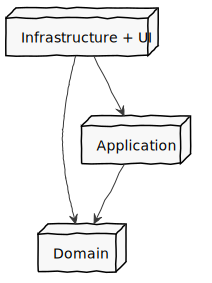

# Package design overview

This project was designed with DDD in mind. It's a slight changed version of Vaughn Vermon layering dependency introduced on _Implementing Domain Driven Design_.

As hi suggested, the infrastructure position was inverted, putting it on top despite to leave it in the bottom. He changes the traditional view of Eric Evans to better applied DIP and SRP. What was changed here from Vermons model is that the UI and Infrastructure layers have been squashed into as single package, although their responsibilities are still separate.

As the *aspnet core* reference is tight coupled to programs startup, also the API logic is to thin for having its own layer, so the *web api* controllers were added to API folder inside the infrastructure package.

It's not usual to have an application layer in *dotnet* projects, although this layer should be decoupled from the layer UI more often. The UI changes should not impact on application layer. For example, if our SOA applications protocol of communication changes from gRPC to HTPP Rest, it's expected to change only the UI layer. I could even have both implementation in separate solutions.

Application logic is exposed to the UI vie events. This project leverage of an event driven design, enabled by Mediatr nuget package. This way the UI layer needs to know only the application layer classes which imports `IRequest<T>` interface, not even the domain objects need to be imported. That reduces UI layer contact area to the application layer and the rest of solution. Application `IRequest<T>` objects behave as commands, that express business intends. This layer is also for a cross-cutting concern, the commands validations.

Least, but not last, there is the Domain, which has no references. It destiles all business logic. The Domain logic expose to application and infrastructure layer repositories, services and aggregates.

Agnostic of layer, there is some cross-cutting concerns, which will be executed inside a commands pipeline. Those concerns will be run before and after the commands execution. So far there is a log and validation behavior.