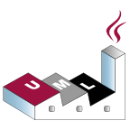

# MVS.Template.CSharp Project

## Project status

Staging env ``

Master 

Develop 

SonarCloud    

## Stack 

It's boilerplate that provides a rich technologie stack, that set your project up and running.

### Package manager

  

### Architechture and desing

&nbsp;&nbsp;&nbsp;&nbsp; 

### Documantation

     

### Testing

       

### Build 

     

### CI

    

### Deploy

   

### Quality gate

 
